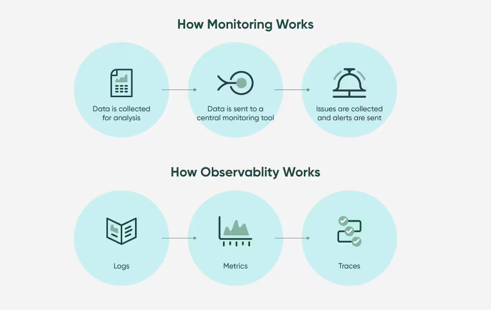
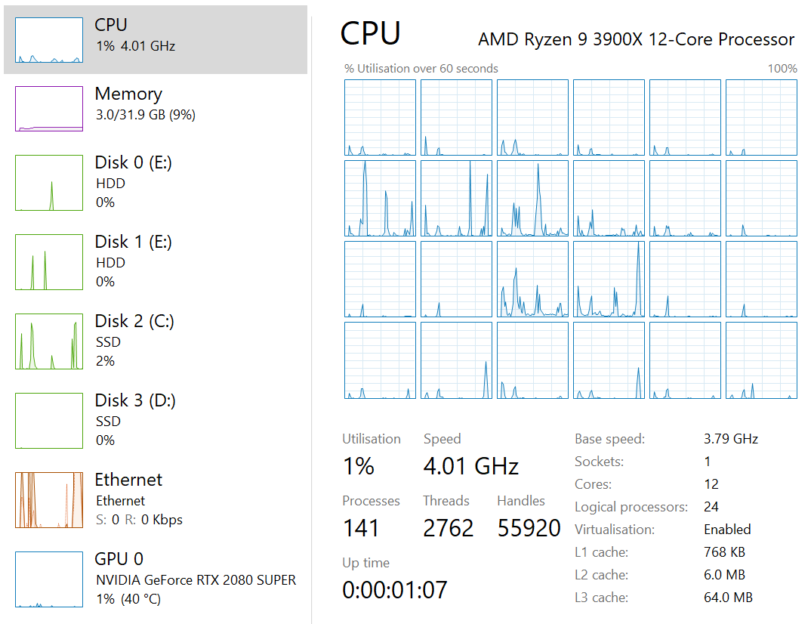
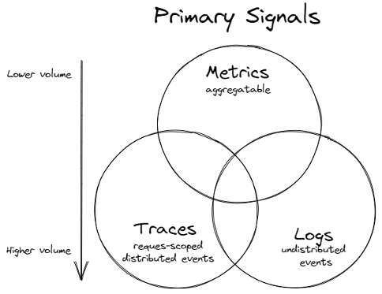
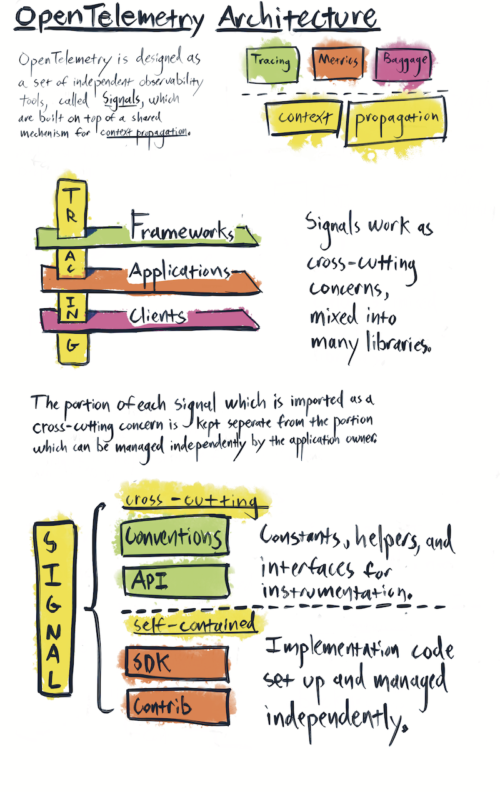

Hello，
咱们假如说
你的系统出现问题，然后有用户来找你问你，我怎么操作不了等等。你就

# What are events?

Events 事件是任何被认为对业务、安全或故障排除原因重要的事物，范围可以涵盖用户操作、系统错误、配置更改、安全漏洞、网络流量、性能指标、软件更新以及服务状态等。

一些常见的事件示例包括：

- 完成批处理作业。
- 触发定时任务或cron作业。
- 用户权限或角色的更改。
- 接收传入的HTTP请求。
- 数据库事务，如创建、更新或删除记录。
- 执行函数。
- 注册或验证用户。
- 启动或终止后台进程。
- 写入文件数据。
- 向某个API发出HTTP请求。

# Observability vs Monitoring
可观测性与监控的区别在于其关注的范围和方法：

- **监控(Monitoring)**：主要关注系统的状态和性能指标，通过收集数据并设置警报来检测问题。监控通常是基于已知的指标和阈值进行反应性的操作，以便在系统出现故障或性能下降时及时采取措施。

- **可观测性(Observability)**：更广泛地涵盖了系统的理解和调试能力，包括监控、日志、度量、追踪等多个方面。可观测性强调的是系统内部的透明度和可理解性，使得用户能够深入了解系统的运行情况，从而更好地诊断问题、进行故障排除和优化系统性能。

简而言之，监控更侧重于收集和分析数据以监视系统状态，而可观测性则更关注于全面了解系统的内部运行情况，从而使得问题的诊断和解决更加高效和全面。



# What problem we have
构建高度可观测的系统的一个目标是为了提供对应用行为的有价值洞察。可观测的系统能够通过警报识别和展示问题，使问题在影响最终用户之前被发现。
- Logs 日志

``` 
I, [2021-02-23T13:26:23.505892 #22473]  INFO -- : [6459ffe1-ea53-4044-aaa3-bf902868f730] Started GET "/" for ::1 at 2021-02-23 13:26:23 -0800
```

Logs are an historical record of the various events that occur within a software application, system, or network. They are chronologically ordered so that they can provide a comprehensive timeline of activities, errors, and incidents, enabling you to understand what happened, when it happened, and, often, why it happened.
In computing, logging is the act of keeping a log of events that occur in a computer system, such as problems, errors or just information on current operations.
在计算领域，日志记录是指记录计算机系统中发生的事件，如问题、错误或当前操作的信息。日志记录对于系统的监控、故障排除和性能优化非常重要，可以帮助开发人员和系统管理员了解系统的运行情况，追踪问题的根本原因，并记录重要的操作和事件
- Tracing 追踪


Where logging provides an overview to a discrete, event-triggered log, tracing encompasses a much wider, continuous view of an application. The goal of tracing is to following a program’s flow and data progression.
日志记录提供了离散的、事件触发的日志的概述，而追踪则涵盖了对应用程序更广泛、连续的视图。追踪的目标是跟踪程序的流程和数据传递。通过追踪，可以深入了解应用程序的执行路径，查看数据在系统中的流动方式，以便分析性能问题、优化代码以及理解系统的整体运行情况。相比之下，日志记录更侧重于记录特定事件的发生和相关细节，而追踪则提供了更全面的应用程序执行视图。
- Metrics 指标
指标的目的是向观察者提供有关组件或系统健康状况和运行情况的信息。指标代表特定来源的某一时刻的测量值，数据通常非常小。这种紧凑的大小使得即使在大型系统中也能高效地进行收集。通过收集和分析指标数据，可以监控系统的性能、资源利用情况，识别潜在问题并进行决策。指标在系统监控、故障排除和性能优化方面扮演着关键的角色。

The purpose of metrics is to inform observers about the health & operations regarding a component or system. A metric represents a point in time measure of a particular source, and data-wise tends to be very small. The compact size allows for efficient collection even at scale in large systems.
- Alert 警报
基于预定义的规则或阈值，在系统出现异常或达到特定状态时发出通知。警报可帮助团队及时响应问题，减少对最终用户的影响。
https://microsoft.github.io/code-with-engineering-playbook/observability/log-vs-metric-vs-trace/



# Python OpenTelemetry
OpenTelemetry 是用于监控和跟踪应用程序的一套 API、库、代理和仪表，提供应用程序的可观察性。



安装 OpenTelemetry API 和 SDK:
```commandline
pip install opentelemetry-api
pip install opentelemetry-sdk
```

安装 Exporter 主要 OTLP
安装 Instrumentation

```commandline
pip install opentelemetry-exporter-{exporter}
pip install opentelemetry-instrumentation-{instrumentation}
```

咱们看看一个案例
```python
from opentelemetry import trace
from opentelemetry.exporter.otlp.proto.grpc.trace_exporter import \
    OTLPSpanExporter
from opentelemetry.sdk.resources import Resource
from opentelemetry.sdk.trace import TracerProvider
from opentelemetry.sdk.trace.export import BatchSpanProcessor
resource = Resource.create(attributes={
    "service.name": "ping",
    "compose_service": "ping"
})

tracer = TracerProvider(resource=resource)
trace.set_tracer_provider(tracer)

exporter = OTLPSpanExporter(endpoint="http://localhost:4317")
tracer.add_span_processor(BatchSpanProcessor(exporter))


tracer = trace.get_tracer(__name__)
with tracer.start_as_current_span() as span:
    print("hello world")
```
在分布式跟踪（distributed tracing）中，处理器（TracerProvider）和发送器（SpanExporter）是非常重要的组件。

处理器（TracerProvider）：处理器是一个用于创建和管理跟踪器（tracer）实例的组件。跟踪器用于创建和管理跟踪数据（spans）

发送器（SpanExporter）：发送器是用于将跟踪数据（spans）发送到远程存储或分析系统的组件。

运行后就可以看到运行

# OpenTelemetry Collector


## Vendor-agnostic way to receive, process and export telemetry data.

``` yml
receivers:
  otlp:
    protocols:
      grpc:
        endpoint: 0.0.0.0:4317
exporters:
  debug:
    verbosity: detailed

  otlphttp:
    endpoint: http://loki:3100/otlp/

  otlp:
    endpoint: jaeger:4317
    tls:
      insecure: true
      insecure_skip_verify: true
  otlp/2:
    endpoint: tempo:4317
    tls:
      insecure: true
      insecure_skip_verify: true

processors:

  batch:

  attributes:
    actions:
      - action: insert
        key: loki.attribute.labels
        value: label, duration, http.method, http.url, http.host, http.client_ip, http.user_agent, http.request_id, http.status_code, iam.user_id

service:
  pipelines:
    traces:
      receivers: [ otlp ]
      exporters: [ otlp, otlp/2]
    logs:
      receivers: [ otlp ]
      processors: [attributes]
      exporters: [ otlphttp ]

```

---

## Sampling

Head Sampling
- Easy to understand
- Easy to configure
- Efficient
- Can be done at any point in the trace collection pipeline

Tail Samplling

尾部采样（Tail Sampling）是一种采样技术，与头部采样（Head Sampling）相对应。尾部采样通常用于捕获罕见但重要的事件或异常情况，以便更好地了解系统的行为。以下是关于尾部采样的一些特点：

适用于捕获稀有事件：尾部采样适用于捕获在系统中发生频率较低但可能具有重要影响的事件，如错误、异常或低概率事件。
重点在于异常情况：尾部采样的重点通常放在异常情况或者不寻常事件上，这有助于系统管理员或开发人员更好地理解系统的行为。
难度较大：相对于头部采样，尾部采样可能更具挑战性，因为需要识别和捕获那些发生频率较低的事件。
重要性高：尾部采样对于发现潜在问题、优化系统性能以及改进系统稳定性都非常重要。
尾部采样和头部采样结合使用可以提供更全面的系统监控和故障排除能力，帮助系统管理员和开发人员更好地管理和优化系统。


头部采样是一种数据采集方法，仅选择数据流的开始部分（或“头部”）进行分析。以下是头部采样的一些关键特点：
易于理解：头部采样在概念上很容易理解。它只涉及选择初始数据的一部分进行分析。
易于配置：设置头部采样通常很简单，可以用较少的工作量进行配置。这使得它适用于各种监控和分析任务。
高效：头部采样在资源使用方面是高效的，因为它只关注数据流的初始部分。在处理大量数据时，这种效率至关重要。
实施灵活：头部采样可以在跟踪收集管道的任何时点实施，提供了在何时以及如何进行采样的灵活性。
通过利用头部采样，分析人员和系统管理员可以在不处理整个数据集的情况下，高效地从数据流中获取洞察力，使其成为各种监控和分析场景中的宝贵技术手段。

--- 
上下文传播是分布式系统和软件工程中常用的概念。它涉及随着请求在系统的各个组件或服务中传递时传递上下文信息。这些上下文信息通常包括事务ID、用户ID、时间戳和其他元数据，有助于跟踪和分析请求在系统中的流动。
关于上下文传播的关键点包括：
保持上下文：上下文传播确保在请求通过不同服务或组件时，有关请求或事务的相关信息得以保留和访问。
调试和监控：上下文传播通过提供一种跟踪和关联跨多个服务发生事件的方式，有助于调试和监控分布式系统。
性能优化：有效的上下文传播可以通过减少每个请求传递冗余信息的开销，帮助优化系统性能。
一致性和可靠性：通过传播上下文，系统可以在处理请求时保持一致性和可靠性，特别是在微服务架构中，一个请求可能触发多个服务调用的情况下。
总的来说，上下文传播对于理解和管理分布式系统中请求的流动至关重要，可以实现更好的监控、调试和性能优化。

**Context propagation** 

{'traceparent': '00-9c140c07025c90b01f7fb5826fdc39c7-3de357031a99a618-01'}
